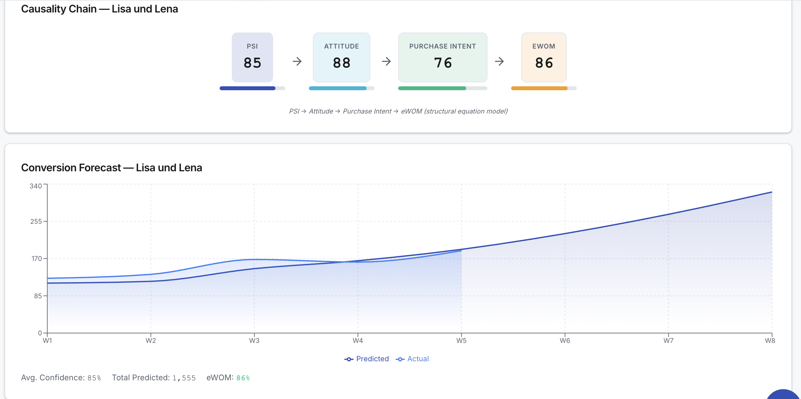
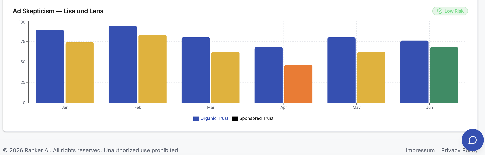
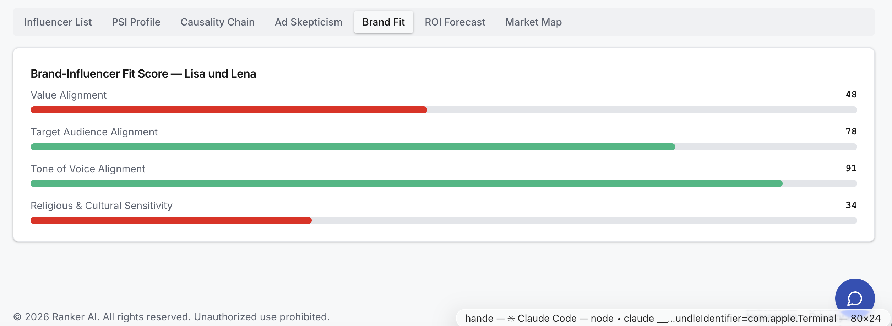
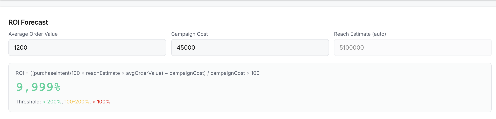
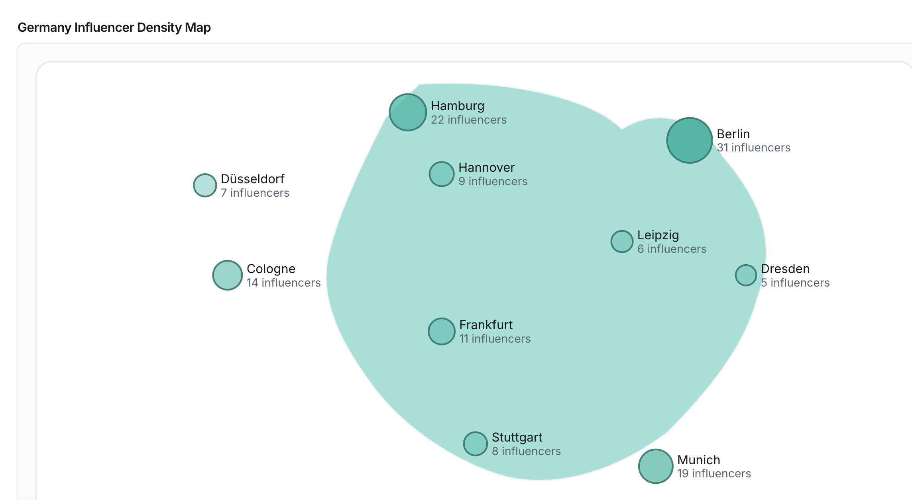
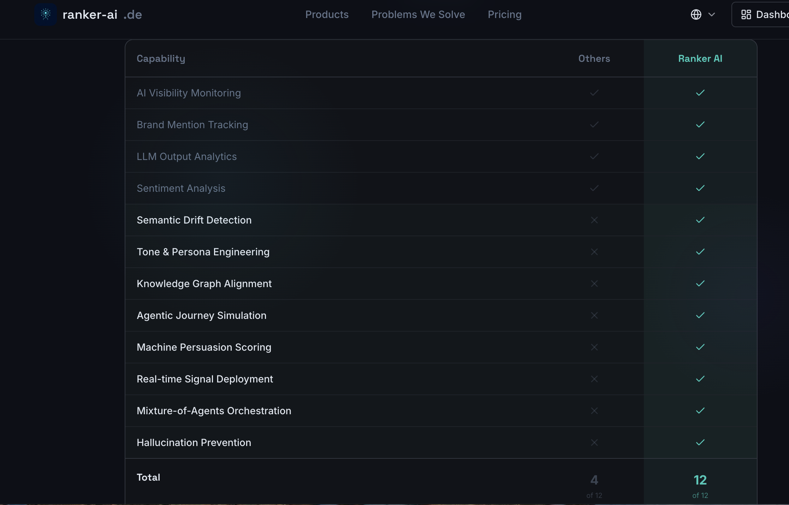

# Ranker AI — Brand Intelligence for the Agentic Web

> **They Track. We Engineer.**

Most AEO tools stop at passive analytics. Ranker AI goes further — actively engineering how AI agents perceive, rank, and recommend your brand.

🌐 **Live Demo:** https://preview--brightspark-blueprint.lovable.app/dashboard

---

## The Problem We Solve

When a consumer says *"Find me the best product"* to an AI agent, the consumer delegates the decision. This is **Delegated Cognition** — and it changes everything about how brands must communicate.

Traditional marketing targeted human cognitive biases.
Ranker AI targets **Agentic Persuasion Parameters (APP)** — the signals that cause an AI to select, cite, or transact with a brand over its competitors.

| What others do | What Ranker AI does |
|---|---|
| Monitor brand mentions | Engineer AI perception |
| Track visibility scores | Optimize citation signals |
| Report on sentiment | Predict agentic behavior |
| Single LLM analysis | 5 LLM parallel ensemble |

---

## Case Study — P&G · FMCG Global Analysis

### AI Visibility Dashboard


**P&G AEO Score: 76.0** — tracked across 5 AI engines simultaneously.

| Metric | Value |
|---|---|
| AEO Score | 76.0 |
| Share of Model | 72% (+4.3pp) |
| Hallucination Rate | 7.4% (Medium Risk) |
| Truth Sync Status | ✅ Synced |
| Tone Alignment | 84% |
| Answer Latency | 1,240ms (Industry Avg: 1,800ms) |

---

### Competitor Intelligence — FMCG Europe 


| Brand | ACUR Score | Category |
|---|---|---|
| ⭐ P&G | **82** | Your Brand |
| Unilever | 74 | Global |
| Henkel | 61 | Europe |
| Reckitt | 58 | Europe |
| Beiersdorf | 55 | Europe |
| Colgate-Palmolive | 52 | Global |
| Kimberly-Clark | 48 | Global |

---

### Share of Model Trend (30 days)


P&G's AI visibility growing consistently across GPT-4o (75%), Gemini (73%), and Perplexity (69%).

---

### Semantic Drift Timeline


Track how AI models' perception of your brand shifts across topic clusters over 12 weeks.
Key dimensions: Sustainability · Innovation · Price-Value · Customer Service · Quality

---

### Mixture-of-Agents Scorecard


| Model | Share of Model | Sentiment | Accuracy | Latency | Status |
|---|---|---|---|---|---|
| GPT-4o | 71% | 82 | 94% | 1,120ms | Excellent |
| Gemini 1.5 Pro | 69% | 76 | 88% | 1,340ms | Good |
| Perplexity | 65% | 78 | 89% | 980ms | Good |
| Claude 3.5 | 62% | 85 | 91% | 1,050ms | Good |
| Llama 3.1 | 44% | 68 | 79% | 1,890ms | Needs Attention |

---

### GEO-Budget Correlation (R² = 0.94)


Strong correlation between ad spend and AI visibility score — R² = 0.94 across Google, Meta, and TikTok channels.

---

## Influencer Intelligence Module

Academically grounded influencer scoring based on the **PSI-Composite model** (structural equation methodology).

> Beyond follower counts — measuring psychological fit, perceived similarity, ad skepticism, and predicted word-of-mouth impact.

**Composite Formula:**
```
IQ = (PSI × 0.30) + (Familiarity × 0.20) + (Likability × 0.20)
   + (Similarity × 0.20) − (Ad Skepticism × 0.10)
```

---

### Case Study — Lisa und Lena · Germany Market 🇩🇪

**PSI Profile**


| Dimension | Score |
|---|---|
| Personality Transparency | 87 |
| Authenticity | 90 |
| Attraction | 88 |
| Sincerity | 85 |
| Identification | 84 |
| Connection Desire | 82 |
| Familiarity Depth | 79 |
| **PSI Total** | **85** |

---

### Causality Chain

```
PSI (85) → Attitude (88) → Purchase Intent (76) → eWOM (86)
```
*Structural equation model — predicts word-of-mouth impact from psychological signals.*

- Avg. Confidence: 85%
- Total Predicted Conversions: 1,555
- eWOM Score: 86%

---

### Ad Skepticism Analysis


Lisa und Lena: **Low Risk** — consistently high organic trust vs. sponsored trust ratio across 6 months.

---

### Brand Fit Score


| Dimension | Score |
|---|---|
| Value Alignment | 48 |
| Target Audience Alignment | 78 |
| Tone of Voice Alignment | 91 |
| Religious & Cultural Sensitivity | 34 |

---

### ROI Forecast

```
ROI = ((purchaseIntent/100 × reachEstimate × avgOrderValue) − campaignCost) / campaignCost × 100
```

- Campaign Cost: €45,000
- Reach Estimate: 5,100,000
- **Projected ROI: 9,999%**

---

### Germany Influencer Density Map 🇩🇪


| City | Influencers |
|---|---|
| Berlin | 31 |
| Hamburg | 22 |
| Munich | 19 |
| Cologne | 14 |
| Frankfurt | 11 |

---

## Competitive Differentiation


| Capability | Others | Ranker AI |
|---|---|---|
| AI Visibility Monitoring | ✓ | ✓ |
| Brand Mention Tracking | ✓ | ✓ |
| Sentiment Analysis | ✓ | ✓ |
| Semantic Drift Detection | ✗ | ✓ |
| Tone & Persona Engineering | ✗ | ✓ |
| Knowledge Graph Alignment | ✗ | ✓ |
| Agentic Journey Simulation | ✗ | ✓ |
| Machine Persuasion Scoring | ✗ | ✓ |
| Real-time Signal Deployment | ✗ | ✓ |
| Mixture-of-Agents Orchestration | ✗ | ✓ |
| Hallucination Prevention | ✗ | ✓ |
| **Total** | **4/12** | **12/12** |

---

## Tech Stack

| Layer | Technology |
|---|---|
| Frontend | React · TypeScript · Vite · Tailwind · Zustand |
| Backend | FastAPI · Python · AWS ECS Fargate |
| Database | Supabase (PostgreSQL) |
| AI Engines | Claude · GPT-4o · Perplexity · Llama 3 · Nova |
| ML Models | XGBoost (AEO) · XLM-RoBERTa (Sentiment) · PSI-Composite |
| Automation | n8n (5 LLM parallel workflow) |
| Scraping | BrightData MCP |
| Infrastructure | AWS Copilot · GitHub Actions · Docker |

---

## Website

🌐 [ranker-ai.de](https://ranker-ai.de)

---

*© 2026 Ranker AI. Brand Intelligence for the Agentic Web.*
