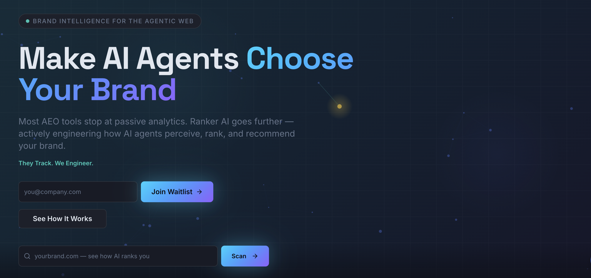
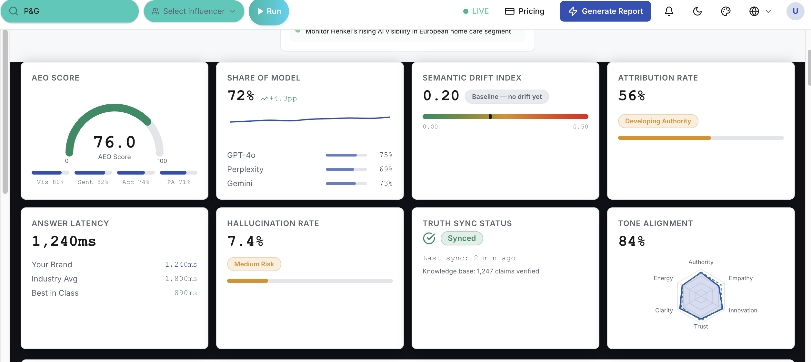
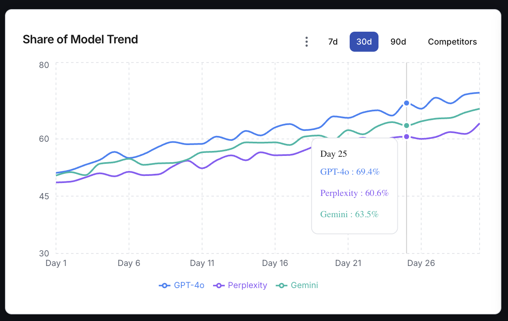
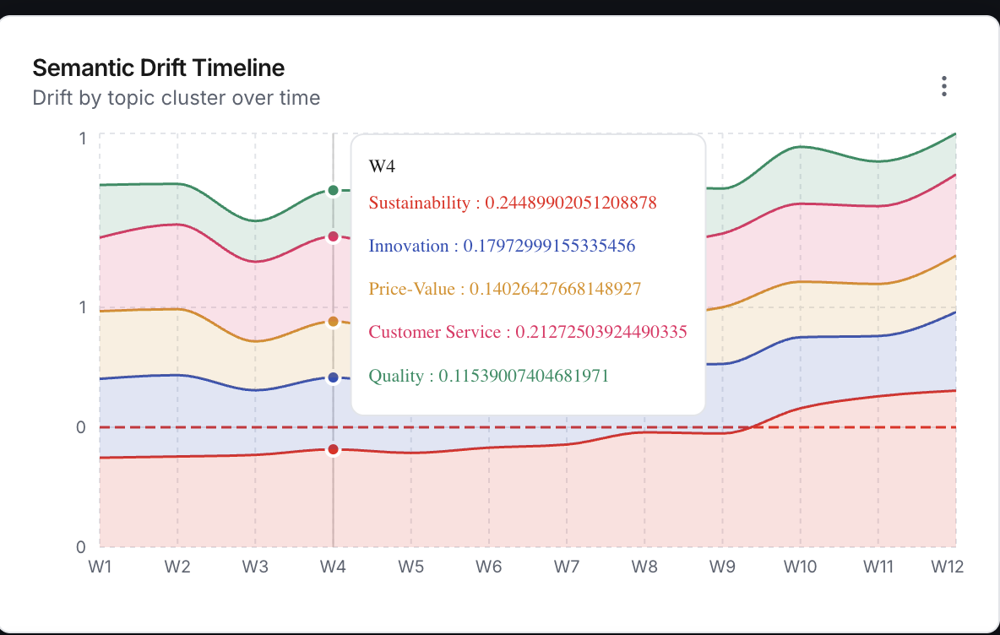
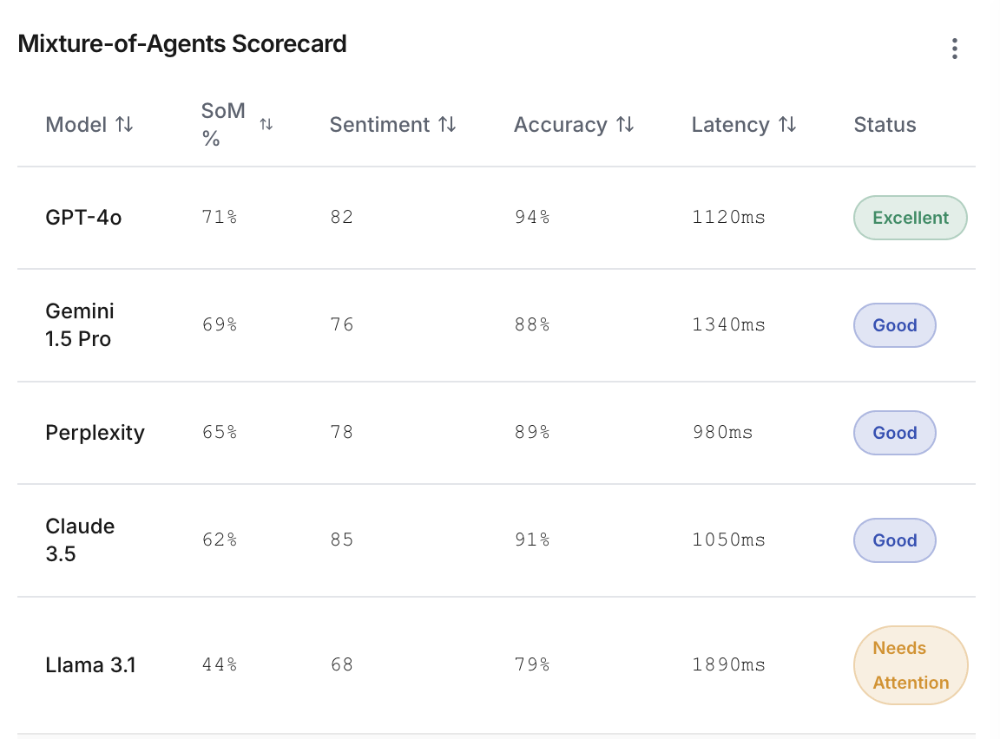
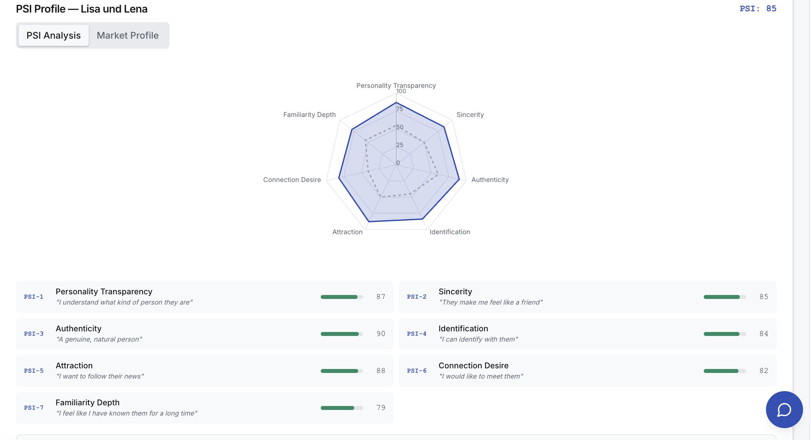
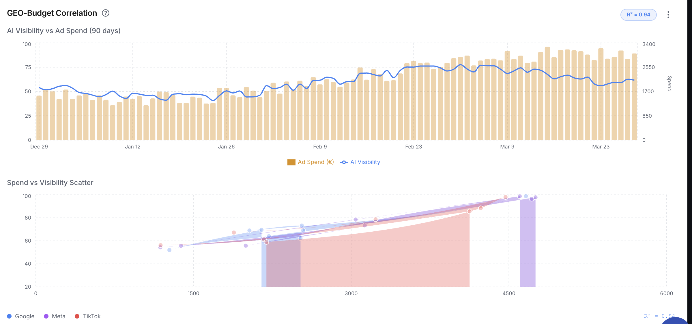
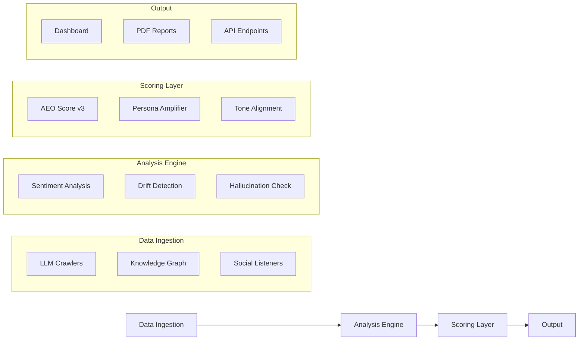

[](LICENSE)
[](https://github.com/hgabrali/ranker-ai-demo)

<div align="center">



<h3>Brand Intelligence for the Agentic Web</h3>

<br/>

[](https://github.com/hgabrali/ranker-ai-demo/stargazers)
[](https://github.com/hgabrali/ranker-ai-demo/network)
[](https://github.com/hgabrali/ranker-ai-demo/issues)
[](LICENSE)

<br/>

[Documentation](#-architecture) · [Report Bug](https://github.com/hgabrali/ranker-ai-demo/issues)

</div>

---

## ⚡ Overview

**Ranker AI** is a next-generation brand intelligence platform purpose-built for the agentic web. While most AEO (Answer Engine Optimization) tools stop at passive analytics — monitoring mentions, tracking visibility scores, reporting sentiment — Ranker AI goes further by **actively engineering how AI agents perceive, rank, and recommend your brand**.

> When a consumer says *"Find me the best product"* to an AI agent, the consumer delegates the decision. This is **Delegated Cognition** — and it changes everything about how brands must communicate.

Traditional marketing targeted human cognitive biases. Ranker AI targets **Agentic Persuasion Parameters (APP)** — the signals that cause an AI to select, cite, or transact with a brand over its competitors.

### Why Ranker AI?

- **Active Engineering, Not Passive Tracking** — We don't just tell you where you stand; we change where you stand
- **Mixture-of-Agents Orchestration** — Parallel analysis across 5 leading LLMs (GPT-4o, Gemini, Claude, Perplexity, Llama)
- **Hallucination Prevention** — Real-time truth-sync to eliminate AI misinformation about your brand
- **Semantic Drift Correction** — Detect and correct how AI models' perception of your brand shifts over time
- **Influencer Intelligence** — Academically grounded PSI-Composite scoring beyond follower counts

---

## 📸 Screenshots

<div align="center">
<table>
<tr>
<td></td>
<td></td>
</tr>
<tr>
<td></td>
<td></td>
</tr>
<tr>
<td></td>
<td></td>
</tr>
</table>
</div>

---

## 🔄 How It Works

```
┌─────────────────┐     ┌──────────────────┐     ┌─────────────────┐     ┌─────────────────┐
│  Data Ingestion │────▶│    Analysis      │────▶│    Scoring      │────▶│    Output       │
│                 │     │                  │     │                 │     │                 │
│ • LLM Crawlers  │     │ • Sentiment      │     │ • AEO Score v3  │     │ • Dashboard     │
│ • Knowledge Graph│     │ • Drift Detection │     │ • Persona Amp.  │     │ • PDF Reports   │
│ • Social Listeners│     │ • Hallucination  │     │ • Tone Alignment│     │ • API Endpoints │
└─────────────────┘     └──────────────────┘     └─────────────────┘     └─────────────────┘
```

1. **Connect Your Brand** — Define your brand truth, tone guidelines, and target personas
2. **Monitor AI Engines** — We query leading AI models and track every mention, recommendation, and citation
3. **Measure & Optimize** — Get actionable insights with AEO scores, causal impact analysis, and weekly action plans

---

## 🏢 Case Study — P&G · FMCG Global Analysis

### AI Visibility Dashboard

**P&G AEO Score: 76.0** — tracked across 5 AI engines simultaneously.

| Metric | Value |
|---|---|
| AEO Score | 76.0 |
| Share of Model | 72% (+4.3pp) |
| Hallucination Rate | 7.4% (Medium Risk) |
| Truth Sync Status | ✅ Synced |
| Tone Alignment | 84% |
| Answer Latency | 1,240ms (Industry Avg: 1,800ms) |

### Competitor Intelligence — FMCG Europe

| Brand | ACUR Score | Category |
|---|---|---|
| ⭐ P&G | **82** | Your Brand |
| Unilever | 74 | Global |
| Henkel | 61 | Europe |
| Reckitt | 58 | Europe |
| Beiersdorf | 55 | Europe |
| Colgate-Palmolive | 52 | Global |
| Kimberly-Clark | 48 | Global |

### Share of Model Trend (30 days)

P&G's AI visibility growing consistently across GPT-4o (75%), Gemini (73%), and Perplexity (69%).

### Mixture-of-Agents Scorecard

| Model | Share of Model | Sentiment | Accuracy | Latency | Status |
|---|---|---|---|---|---|
| GPT-4o | 71% | 82 | 94% | 1,120ms | Excellent |
| Gemini 1.5 Pro | 69% | 76 | 88% | 1,340ms | Good |
| Perplexity | 65% | 78 | 89% | 980ms | Good |
| Claude 3.5 | 62% | 85 | 91% | 1,050ms | Good |
| Llama 3.1 | 44% | 68 | 79% | 1,890ms | Needs Attention |

### GEO-Budget Correlation (R² = 0.94)

Strong correlation between ad spend and AI visibility score — R² = 0.94 across Google, Meta, and TikTok channels.

---

## 🎯 Influencer Intelligence Module

Academically grounded influencer scoring based on the **PSI-Composite model** (structural equation methodology).

> Beyond follower counts — measuring psychological fit, perceived similarity, ad skepticism, and predicted word-of-mouth impact.

**Composite Formula:**

```
IQ = (PSI × 0.30) + (Familiarity × 0.20) + (Likability × 0.20) + (Similarity × 0.20) − (Ad Skepticism × 0.10)
```

### Case Study — Lisa und Lena · Germany Market 🇩🇪

| Dimension | Score |
|---|---|
| Personality Transparency | 87 |
| Authenticity | 90 |
| Attraction | 88 |
| Sincerity | 85 |
| Identification | 84 |
| Connection Desire | 82 |
| Familiarity Depth | 79 |
| **PSI Total** | **85** |

**Causality Chain:**

```
PSI (85) → Attitude (88) → Purchase Intent (76) → eWOM (86)
```

| Metric | Value |
|---|---|
| Avg. Confidence | 85% |
| Total Predicted Conversions | 1,555 |
| eWOM Score | 86% |
| Ad Skepticism Risk | Low |
| Projected ROI | 9,999% |
| Campaign Cost | €45,000 |
| Reach Estimate | 5,100,000 |

---

## ⚔️ Competitive Differentiation

| Capability | Others | Ranker AI |
|---|---|---|
| AI Visibility Monitoring | ✓ | ✓ |
| Brand Mention Tracking | ✓ | ✓ |
| Sentiment Analysis | ✓ | ✓ |
| Semantic Drift Detection | ✗ | ✓ |
| Tone & Persona Engineering | ✗ | ✓ |
| Knowledge Graph Alignment | ✗ | ✓ |
| Agentic Journey Simulation | ✗ | ✓ |
| Machine Persuasion Scoring | ✗ | ✓ |
| Real-time Signal Deployment | ✗ | ✓ |
| Mixture-of-Agents Orchestration | ✗ | ✓ |
| Hallucination Prevention | ✗ | ✓ |
| **Total** | **4/12** | **12/12** |

---

## 🏗️ Architecture



---

## 🛠️ Tech Stack

| Layer | Technology |
|---|---|
| **Frontend** | React · TypeScript · Vite · Tailwind CSS · Zustand |
| **Backend** | FastAPI · Python · AWS ECS Fargate |
| **Database** | Supabase (PostgreSQL) |
| **AI Engines** | Claude · GPT-4o · Perplexity · Llama 3 · Nova |
| **ML Models** | XGBoost (AEO) · XLM-RoBERTa (Sentiment) · PSI-Composite |
| **Automation** | n8n (5 LLM parallel workflow) |
| **Scraping** | BrightData MCP |
| **Infrastructure** | AWS Copilot · GitHub Actions · Docker |

---

## 🚀 Quick Start

### Prerequisites

| Tool | Version | Description |
|---|---|---|
| **Node.js** | 18+ | Frontend runtime |
| **Python** | ≥3.11 | Backend runtime |
| **Docker** | Latest | Container orchestration |

### Installation

```bash
# Clone the repository
git clone https://github.com/hgabrali/ranker-ai-demo.git
cd ranker-ai-demo

# Install frontend dependencies
npm install

# Start the development server
npm run dev
```

The application will be available at `http://localhost:5173`

### Docker Deployment

```bash
# Build and start with Docker Compose
docker compose up -d
```

---

## 📁 Project Structure

This demo repository is part of a larger modular ecosystem:

| Repository | Description | Access |
|---|---|---|
| **ranker-ai** | Core AI engine & backend services | 🔒 Private |
| **semantic-visibility-dashboard** | Real-time analytics dashboard | 🔒 Private |
| **data-visualization-studio** | Data visualization & reporting | 🔒 Private |
| **ranker-ai-demo** | Public demo & documentation | 🌐 Public |

```
ranker-ai-demo/
├── assets/
│   └── screenshots/       # Dashboard & feature screenshots
├── src/
│   ├── components/        # React UI components
│   ├── pages/             # Route pages
│   ├── hooks/             # Custom React hooks
│   ├── lib/               # Utility functions
│   └── types/             # TypeScript definitions
├── public/                # Static assets
├── README.md
└── package.json
```

---

## 🗺️ Roadmap

- [x] AEO Score Engine (v3) with 5 LLM parallel analysis
- [x] Semantic Drift Detection & Timeline
- [x] Mixture-of-Agents Scorecard
- [x] PSI-Composite Influencer Intelligence
- [x] GEO-Budget Correlation Analysis
- [x] Competitor Intelligence Dashboard
- [ ] Real-time Signal Deployment API
- [ ] Knowledge Graph Auto-Alignment
- [ ] Agentic Journey Simulation Engine
- [ ] Multi-language Support (DE, TR, FR)
- [ ] Enterprise SSO & Team Management

---

## 🤝 Contributing

Contributions are welcome! Please feel free to submit a Pull Request.

1. Fork the repository
2. Create your feature branch (`git checkout -b feature/amazing-feature`)
3. Commit your changes (`git commit -m 'feat: add amazing feature'`)
4. Push to the branch (`git push origin feature/amazing-feature`)
5. Open a Pull Request

---

## 📄 License

This project is proprietary software. See [LICENSE](LICENSE) for details.

---

<div align="center">

**[Report Bug](https://github.com/hgabrali/ranker-ai-demo/issues)**

<br/>

*© 2026 Ranker AI. Brand Intelligence for the Agentic Web.*

<br/>

<sub>Built with ❤️ by the Ranker AI Team</sub>

</div>
