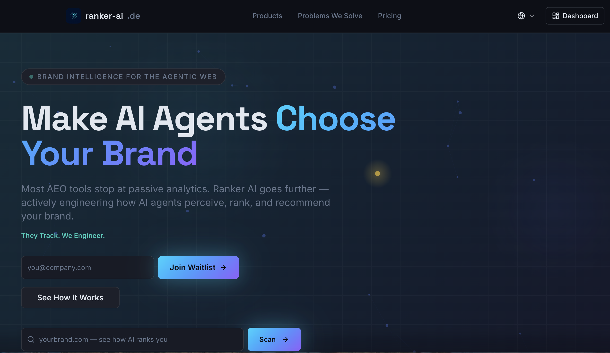
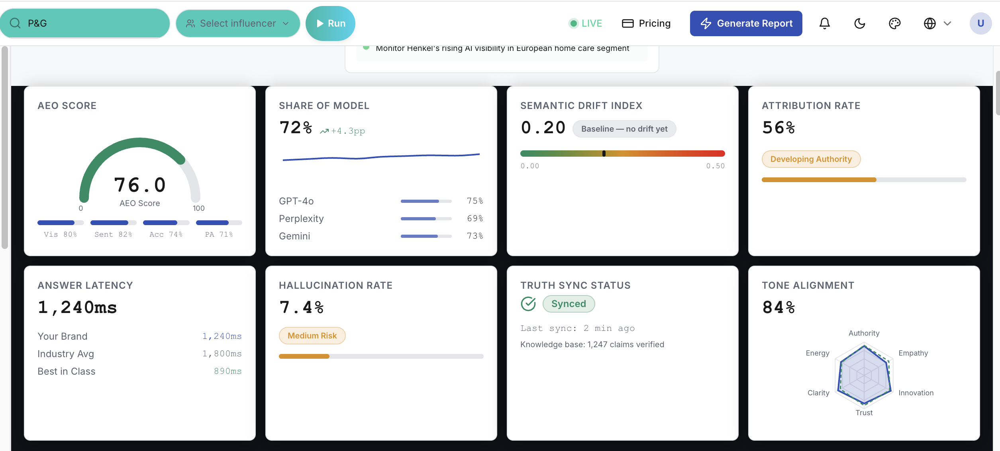
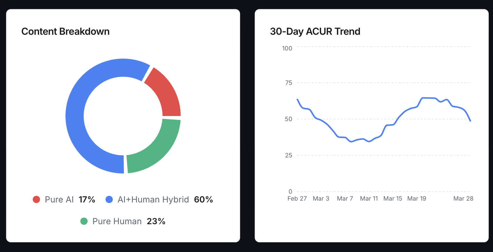
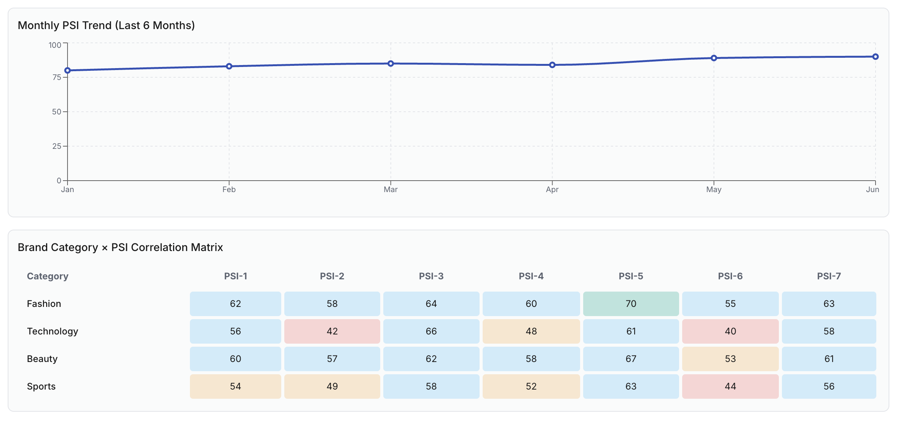

<!--
Ranker AI — Brand Intelligence for the Agentic Web
Portfolio & Learning Project · 23 February 2026 – 28 March 2026
-->

<picture>
<source
media="(prefers-color-scheme: dark)"
srcset="assets/screenshots/ranker-ai-banner.png"
/>

</picture>

# Ranker AI

A next-generation brand intelligence platform purpose-built for the agentic web.


-purple.svg)


> **Portfolio & Learning Project** · 23 February 2026 – 28 March 2026
> Developed as part of an applied research cycle in ML Engineering, AEO/GEO market analysis, and full-stack AI product development.

---

> ### Research Framing & Demo Disclaimer
>
> Ranker AI is an **early-stage portfolio and learning project**, not a commercial product or a validated measurement system. It demonstrates product thinking, UI engineering, and ML pipeline design around AEO/GEO and influencer analytics.
>
> **All brand names, scores, and figures in the case studies below (P&G, the competitor table, the Mixture-of-Agents scorecard, the GEO-budget analysis, and the Lisa und Lena influencer study) are illustrative / synthetic and are provided for demonstration purposes only. They do not represent real measurements of the named companies or individuals.**
>
> The goal of this repository is to show *how* such a system could be designed and what the resulting interface would look like — not to publish empirical results. Methods that are described as research-grade (e.g. ranking evaluation with NDCG/MRR) are tracked as open work items in the roadmap.

---

## Documentation

- [**Project Background**](#project-background) — Research methodology, competitive analysis, and key findings
- [**Overview**](#overview) — What Ranker AI does and why it matters
- [**How It Works**](#how-it-works) — Architecture pipeline from ingestion to output
- [**Case Study: P&G**](#case-study--pg--fmcg-global-analysis) — Illustrative FMCG analysis with AEO scoring
- [**Influencer Intelligence**](#influencer-intelligence-module) — PSI-Composite model & Lisa und Lena case study

[Why Ranker AI?](#why-ranker-ai) | [Tech Stack](#tech-stack) | [Quick Start](#quick-start) | [Roadmap](#roadmap) | [Contributing](#contributing)

---

## Why Ranker AI?

Ranker AI is a modern brand intelligence and AI visibility engineering platform. While most AEO tools stop at passive analytics — monitoring mentions, tracking visibility scores, reporting sentiment — Ranker AI aims to go further by **actively engineering** how AI agents perceive, rank, and recommend your brand.

When a consumer says *"Find me the best product"* to an AI agent, the consumer delegates the decision. This is **Delegated Cognition** — and it changes everything about how brands must communicate.

Ranker AI provides:

- **Active Engineering, Not Passive Tracking** — we don't just report where you stand; we change where you stand *(product vision)*
- **Mixture-of-Agents Orchestration** — parallel analysis across 5 LLMs: GPT-4o, Gemini, Claude, Perplexity, Llama
- **Hallucination Mitigation** — truth-sync designed to detect, reduce, and flag AI misinformation about your brand
- **Semantic Drift Correction** — detect and correct how AI models' perception of your brand shifts over time
- **Influencer Intelligence** — academically grounded PSI-Composite scoring beyond follower counts
- **Agentic Persuasion Parameters (APP)** — target the inference-time signals that cause an AI to select, cite, or transact with a brand

---

## Screenshots & Demos

> All dashboards below display **illustrative / synthetic data** for demonstration only.

**Hero — AI Visibility Dashboard**

<kbd></kbd><br/>

**P&G AEO Scorecard**

<kbd></kbd><br/>

**P&G AEO Scorecard (Light Mode)**

<kbd></kbd><br/>

**Competitor Intelligence Table**

<kbd></kbd><br/>

**Mixture-of-Agents Scorecard**

<kbd></kbd><br/>

**Share of Model Trend**

<kbd></kbd><br/>

**Semantic Drift Detection**

<kbd></kbd><br/>

**GEO-Budget Correlation**

<kbd></kbd><br/>

**Content Breakdown**

<kbd></kbd><br/>

**Influencer PSI Profile — Lisa und Lena**

<kbd></kbd><br/>

**PSI Trend Matrix**

<kbd></kbd><br/>

**Causality Chain**

<kbd></kbd><br/>

**ROI Forecast**

<kbd></kbd><br/>

**Ad Skepticism Analysis**

<kbd></kbd><br/>

**Brand Fit Analysis**

<kbd></kbd><br/>

**Germany Market Map**

<kbd></kbd><br/>

---

## How It Works
```
┌─────────────────┐ ┌──────────────────┐ ┌─────────────────┐ ┌─────────────────┐
│ Data Ingestion │────▶│ Analysis │────▶│ Scoring │────▶│ Output │
│ │ │ │ │ │ │ │
│ • LLM Crawlers │ │ • Sentiment │ │ • AEO Score │ │ • Dashboard │
│ • Knowledge Graph│ │ • Drift Detection│ │ • Persona Amp. │ │ • PDF Reports │
│ • Social Listeners│ │ • Hallucination │ │ • Tone Alignment│ │ • API Endpoints │
└─────────────────┘ └──────────────────┘ └─────────────────┘ └─────────────────┘
```

1. **Connect Your Brand** — Define brand truth, tone guidelines, and target personas
2. **Monitor AI Engines** — Query leading AI models; track every mention, recommendation, and citation
3. **Measure & Optimise** — Get actionable insights via AEO scores, causal impact analysis, and weekly action plans

---

## Project Background

### Research Period

**23 February 2026 – 28 March 2026** (33 days)

### Objectives

This project was initiated as a structured learning exercise with three parallel goals:

- **Market Understanding** — Analyse the AEO (Answer Engine Optimisation) and GEO (Generative Engine Optimisation) landscape to understand what AI-visibility products do at a feature and architecture level.
- **Product Scope Definition** — Map the gap between existing monitoring-centric tools and ML-pipeline-centric approaches to determine a feasible differentiation axis.
- **Technical Practice** — Apply a production-oriented web stack (Vite + React + TypeScript + Supabase + FastAPI) in the context of a domain-relevant portfolio project, with emphasis on ML model integration (XGBoost, XLM-RoBERTa) and multi-agent orchestration.

### Methodology

#### Competitive Analysis

The following platforms were investigated through documentation review, third-party comparisons, and public feature disclosures:

| Platform | Category | Funding | Notable Capability |
|---|---|---|---|
| Profound | Enterprise GEO | $58.5M (Sequoia) | Agent Analytics, 400M+ prompt dataset, SOC-2 Type II |
| Peec AI | SMB Monitoring | $29M (20VC) | UI-scraping methodology, dual brand/source visibility |
| Goodie AI | AEO/GEO | Custom enterprise | End-to-end optimisation hub, hallucination detection |
| xSeek | Monitoring + Action | — | 6-engine coverage, built-in AI strategists |

#### Feature Mapping

A preliminary capability matrix was constructed comparing 12 feature dimensions across the above platforms, including sentiment analysis, knowledge graph alignment, agentic journey simulation, and hallucination prevention.

> ⚠️ **Methodological Note:** The competitive matrix in this repository represents a first-pass draft based on publicly available information as of March 2026. It has not been fully validated against vendor API documentation. Scores for competitor platforms are likely understated — particularly for Profound, which offers Agent Analytics, agentic workflow automation, and hallucination provenance tracking. The matrix should be treated as directional, not authoritative, and is flagged for revision in the next iteration.

#### Key Concepts Studied

- Hallucination tracking and citation provenance in LLM-generated responses
- Knowledge graph alignment and entity-level brand representation
- Agentic search behaviour, multi-step query fan-out, and delegated cognition
- Share-of-voice (SoV) as a proxy metric for AI visibility
- PSI-Composite modelling for influencer scoring (structural equation methodology)
- Multi-agent orchestration patterns across heterogeneous LLMs

### Findings

**Finding 1 — Market is monitoring-heavy, action-light.**
The majority of surveyed platforms track brand visibility across LLMs but stop short of prescriptive ML-driven recommendations. Actionability is typically limited to manually curated content suggestions rather than automated signal engineering.

**Finding 2 — No ML/ranking-pipeline-centric tool identified.**
Existing tools treat LLM citation ranking as a black box. None of the surveyed platforms expose or directly optimise the underlying scoring and retrieval signals — embedding similarity, re-ranking weights, knowledge graph entity confidence — that determine citation order in AI-generated responses.

**Finding 3 — Differentiation axis for Ranker AI.**
The identified gap sits at the intersection of **ranking algorithm transparency** and **active AI visibility engineering** — an area aligned with ML Engineering skills (embedding models, NDCG/MRR metrics, similarity search, reranking) rather than traditional SEO or passive monitoring.

**Finding 4 — "Delegated Cognition" as a framing shift.**
As AI agents increasingly complete transactional decisions on behalf of users, brand optimisation must shift target from human cognitive biases to the inference-time signals that cause an agent to select, cite, or transact with a brand. This framing shaped Ranker AI's product direction.

### Next Steps

- [ ] Implement a baseline ranking pipeline with documented design decisions
- [ ] Add standard IR evaluation metrics: NDCG, MRR, Precision@K
- [ ] Revise competitive feature matrix against verified vendor API documentation
- [ ] Deploy a minimal demo endpoint exposing the AEO scoring pipeline
- [ ] Add baseline model comparisons (TF-IDF vs. embedding-based vs. XGBoost)
- [ ] Document architectural decisions in `/docs/architecture.md`

---

## Case Study — P&G · FMCG Global Analysis

> **Illustrative example.** All brand names, scores, and figures in this case study are illustrative / synthetic for demonstration only and do not represent measurements of the named companies.

### AI Visibility Dashboard

> P&G AEO Score: **76.0** — tracked across 5 AI engines simultaneously.

| Metric | Value |
|---|---|
| AEO Score | 76.0 |
| Share of Model | 72% (+4.3pp) |
| Hallucination Rate | 7.4% (Medium Risk) |
| Truth Sync Status | ✅ Synced |
| Tone Alignment | 84% |
| Answer Latency | 1,240ms (Industry Avg: 1,800ms) |

<kbd></kbd><br/>

### Competitor Intelligence — FMCG Europe

| Brand | ACUR Score | Category |
|---|---|---|
| ⭐ P&G | 82 | Your Brand |
| Unilever | 74 | Global |
| Henkel | 61 | Europe |
| Reckitt | 58 | Europe |
| Beiersdorf | 55 | Europe |
| Colgate-Palmolive | 52 | Global |
| Kimberly-Clark | 48 | Global |

### Mixture-of-Agents Scorecard

| Model | Share of Model | Sentiment | Accuracy | Latency | Status |
|---|---|---|---|---|---|
| GPT-4o | 71% | 82 | 94% | 1,120ms | Excellent |
| Gemini 1.5 Pro | 69% | 76 | 88% | 1,340ms | Good |
| Perplexity | 65% | 78 | 89% | 980ms | Good |
| Claude 3.5 | 62% | 85 | 91% | 1,050ms | Good |
| Llama 3.1 | 44% | 68 | 79% | 1,890ms | Needs Attention |

<kbd></kbd><br/>

### GEO-Budget Correlation

Illustrative relationship between ad spend and AI visibility score across Google, Meta, and TikTok channels *(illustrative, simulated data — not fitted to real measurements)*.

> P&G's AI visibility growing consistently: GPT-4o (75%), Gemini (73%), Perplexity (69%).

<kbd></kbd><br/>

---

## Influencer Intelligence Module

Academically grounded influencer scoring based on the **PSI-Composite model** (parasocial-interaction construct, structural equation methodology). Measures psychological fit, perceived similarity, ad scepticism, and predicted word-of-mouth impact — beyond follower counts.

### Composite Formula

> *Illustrative weighting — the coefficients below are placeholders for demonstration and are not empirically calibrated.*

```
IQ = (PSI × 0.30) + (Familiarity × 0.20) + (Likability × 0.20)
+ (Similarity × 0.20) − (Ad Skepticism × 0.10)
```

### Case Study — Lisa und Lena · Germany Market 🇩🇪

> **Illustrative example.** All names, scores, and figures in this case study are illustrative / synthetic for demonstration only and do not represent measurements of the named individuals.

| Dimension | Score |
|---|---|
| Personality Transparency | 87 |
| Authenticity | 90 |
| Attraction | 88 |
| Sincerity | 85 |
| Identification | 84 |
| Connection Desire | 82 |
| Familiarity Depth | 79 |
| **PSI Total** | **85** |

**Causality Chain:**
```
PSI (85) → Attitude (88) → Purchase Intent (76) → eWOM (86)
```

| Metric | Value |
|---|---|
| Avg. Confidence | 85% (illustrative) |
| eWOM Score | 86% (illustrative) |
| Ad Scepticism Risk | Low |

<kbd></kbd><br/>
<kbd></kbd><br/>
<kbd></kbd><br/>

---

## Tech Stack

| Layer | Technology |
|---|---|
| Frontend | React · TypeScript · Vite · Tailwind CSS · Zustand |
| Backend | FastAPI · Python · AWS ECS Fargate |
| Database | Supabase (PostgreSQL) |
| AI Engines | Claude · GPT-4o · Perplexity · Llama 3 · Nova |
| ML Models | XGBoost (AEO Scoring) · XLM-RoBERTa (Sentiment) · PSI-Composite |
| Automation | n8n (5 LLM parallel workflow) |
| Scraping | BrightData MCP |
| Infrastructure | AWS Copilot · GitHub Actions · Docker |

---

## Architecture

*See `/docs/architecture.md` (in progress)*

---

## Quick Start

### Prerequisites

| Tool | Version | Description |
|---|---|---|
| Node.js | 18+ | Frontend runtime |
| Python | ≥ 3.11 | Backend runtime |
| Docker | Latest | Container orchestration |

### Installation
```bash
# Clone the repository
git clone https://github.com/hgabrali/ranker-ai-demo.git
cd ranker-ai-demo

# Install frontend dependencies
npm install

# Start the development server
npm run dev
```

Application available at `http://localhost:5173`

### Docker Deployment
```bash
docker compose up -d
```

---

## Project Structure

This demo repository is part of a larger modular ecosystem:

| Repository | Description | Access |
|---|---|---|
| `ranker-ai` | Core AI engine & backend services | 🔒 Private |
| `semantic-visibility-dashboard` | Real-time analytics dashboard | 🔒 Private |
| `data-visualization-studio` | Data visualisation & reporting | 🔒 Private |
| `ranker-ai-demo` | Public demo & documentation | 🌐 Public |
```
ranker-ai-demo/
├── assets/
│ └── screenshots/ # Dashboard & feature screenshots
├── src/
│ ├── components/ # React UI components
│ ├── pages/ # Route pages
│ ├── hooks/ # Custom React hooks
│ ├── lib/ # Utility functions
│ └── types/ # TypeScript definitions
├── public/ # Static assets
├── docs/
│ └── architecture.md # (in progress)
├── README.md
└── package.json
```

---

## Roadmap

### Implemented (demo UI)

> These items have a working demonstration interface. "Implemented (demo UI)" means the interface and pipeline scaffolding exist; it does **not** mean the underlying methods have been empirically validated. Method validation (e.g. ranking evaluation) is tracked under *In Progress*.

- [x] AEO Score Engine with 5-LLM parallel analysis
- [x] Semantic Drift Detection & Timeline
- [x] Mixture-of-Agents Scorecard
- [x] PSI-Composite Influencer Intelligence
- [x] GEO-Budget Correlation Analysis
- [x] Competitor Intelligence Dashboard

### In Progress

- [ ] Real-time Signal Deployment API
- [ ] Knowledge Graph Auto-Alignment
- [ ] Agentic Journey Simulation Engine
- [ ] Ranking pipeline with NDCG / MRR / Precision@K metrics
- [ ] Baseline model comparison (TF-IDF vs. embedding-based vs. XGBoost)
- [ ] Revised competitive feature matrix (vendor-verified)

### Planned

- [ ] Multi-language Support (DE, TR, FR)
- [ ] Enterprise SSO & Team Management
- [ ] `/docs/architecture.md` — full system design documentation

---

## Contributing

Contributions are welcome. Please follow standard Git flow:
```bash
git checkout -b feature/your-feature
git commit -m 'feat: describe your change'
git push origin feature/your-feature
# Open a Pull Request
```

---

## License

This project is proprietary software. See `LICENSE` for details.

---

*Built as part of an ML Engineering portfolio — MasterSchool · 2026*
